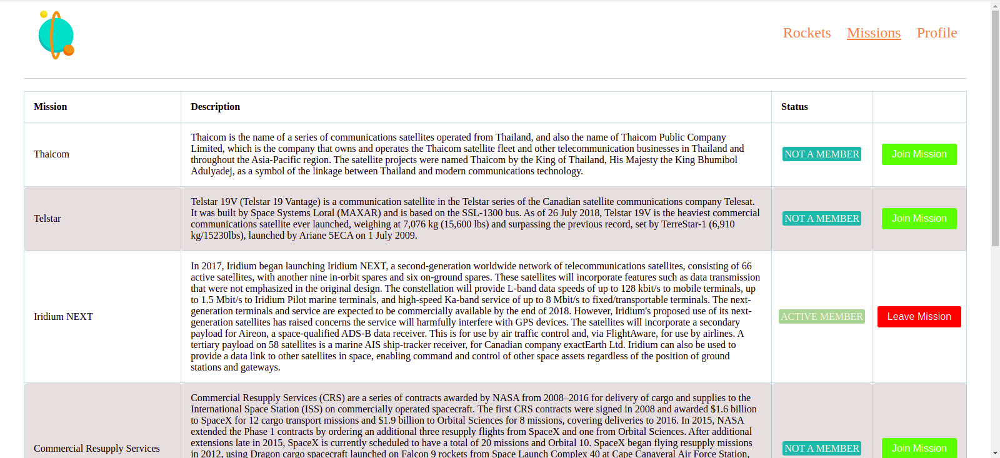

# Space Traverler's Hub

 web application for a company that provides commercial and scientific space travel services. The application will allow users to book rockets and join selected space missions, using real live data from SpaceX API

 ## Live link
 [Link](https://trusting-stonebraker-60f031.netlify.app/)

## Built With

- JavaScript
- React
- Redux
- HTML
- CSS
- Eslint
- Stylelint
- API

## Getting Started

To get a local copy up and running follow these simple example steps.

`git clone https://github.com/Rayan84/space-travelers-hub.git`

### Installation

- open your terminal
- run `cd space-travelers-hub`
- run `npm install`
- run `npm start`
- on your browser open http://localhost:3000/

## Authors

👤 **Isaac William Lumato**

- GitHub: [@isaka-lumato](https://github.com/isaka-lumato)
- Twitter: [@Isaac Lumato](https://twitter.com/lumato_isaac)
- LinkedIn: [Isaka Lumato](https://www.linkedin.com/in/isaka-william-90773020b/)

👤 **Rayan Rassam**

- GitHub: [@Rayan84](https://github.com/Rayan84)
- Twitter: [@Rayan65096267](https://twitter.com/Rayan65096267)
- LinkedIn: [Rayan Rassam](https://www.linkedin.com/in/rayan-rassam/)

## 🤝 Contributing

Contributions, issues, and feature requests are welcome!

Feel free to check the [issues page](../../issues/).

## Show your support

Give a ⭐️ if you like this project!

## Acknowledgments

- Microverse

